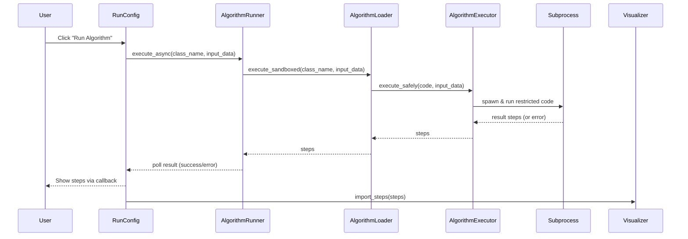
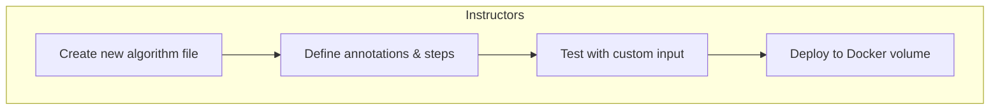
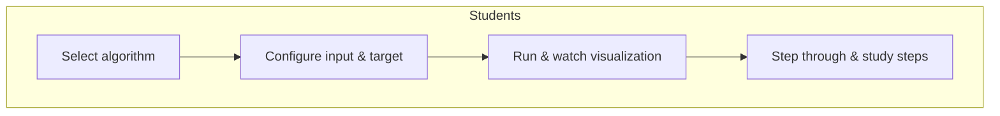
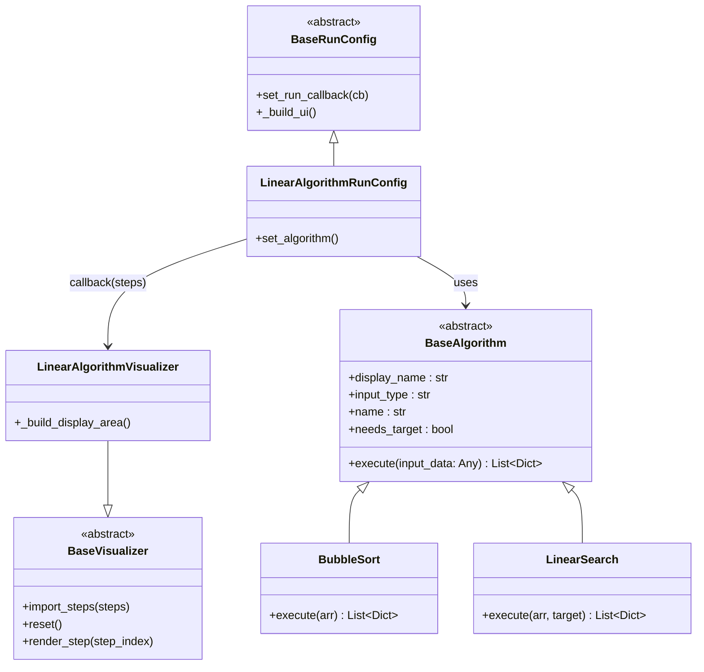

# Architecture Overview

The DSA Visualizer is built around **SOLID principles** and a clean separation of concerns. Its design is intended to allow new algorithms, data structures, and visualization types (trees, graphs, etc.) to be added without modifying core code.

## High-Level Design

The application is organized into three main layers:

1. **Run Configuration** (subclasses of `BaseRunConfig`) – gathers user input and triggers execution.
2. **Execution Services** – load, sandbox, and asynchronously run algorithms.
3. **Visualization** (subclasses of `BaseVisualizer`) – displays generated steps, handles playback, and optionally provides interactive operation panels for data structures.

All layers communicate through abstract interfaces (`BaseAlgorithm`, `BaseVisualizer`, `BaseDataStructure`) and a central **Component Registry**, which completely decouples the UI from concrete implementations.

## Asynchronous Execution Flow

When a user presses **Run Algorithm**, the following sequence occurs:



Key points:

- Execution is **sandboxed** in a subprocess with restricted builtins and AST verification.
- Concurrency is limited by a semaphore (configurable via `ALGO_MAX_CONCURRENT`).
- The UI never blocks – `AlgorithmRunner` polls a queue from a NiceGUI timer.

## Use Cases

The system supports two primary roles:




## Core Abstractions

The following diagram shows the key abstract classes and their relationships:



!!! info "Full PlantUML diagrams"
    The complete class diagram and package diagram are available as `.puml` files in the main repository. You can generate images from them using [PlantUML](https://plantuml.com/) if you prefer a more detailed view.

## Component Registry

The **ComponentRegistry** is a thread‑safe singleton that holds every runnable/visualizable component. Each entry stores:

- `type` (e.g., `'algorithm'`, `'datastructure'`)
- `display_name`
- `category` (for sidebar grouping)
- A `build` callable that, given an `AlgorithmLoader`, returns a `(BaseRunConfig, BaseVisualizer)` tuple.

The **sidebar** and **page coordinator** (`src/pages/page_coordinator.py`) read from this registry so adding a new component never requires UI changes. You simply register it in `PageCoordinator._register_components()`.

## Project Structure

```
src/
  algorithms/         – 'compiled' algorithm files (.pyc)
  components/         – reusable UI components (run configs, visualizers, playback)
  datastructures/     – built‑in data structure implementations
  pages/              – NiceGUI page definitions (home.py, page_coordinator.py)
  services/           – loading, sandboxing, rendering, animation
  utils/              – helpers and debug logging
custom-algorithms/    – directory for instructor‑provided algorithm source code
tests/                – unit tests
```

## Configuration and Environment

The application uses a `.env` file and environment variables to configure runtime behavior. The `python-dotenv` library loads the `.env` automatically when present (local development). In Docker, all variables are set directly via `docker-compose.yml`.

Key configuration values:

- **`CUSTOM_ALGORITHMS_DIR`** – specifies the directory containing custom algorithm source files. Default: `./custom-algorithms`. In Docker, this variable is overridden to `/custom-algorithms` so the volume mount works seamlessly.
- **`ARRAY_MAX_LENGTH`**, **`ARRAY_MAX_VALUE`**, **`ARRAY_MIN_VALUE`** – array size and value limits.
- **`ALGO_MAX_CONCURRENT`**, **`ALGO_TIMEOUT`**, **`ALGO_MAX_MEMORY_MB`** – maximum number of subprocesses allowed to run simultaneously and subprocess resource limits.
- **`DEBUG`** – enables detailed logging.
- **`DEMO`** – enables loading of demo/malicious algorithms (for security testing).

## Extensibility Points

The system was designed so that a future development team could add tree or graph visualizations with minimal effort:

1. Implement a new renderer (subclass `BaseRenderer`) for the step type (e.g., `'tree'`).
2. Register it with `AnimationPlayer.add_renderer('tree', renderer_instance)`.
3. Create a visualizer (subclass `StepBasedVisualizer`) that builds a custom display area.
4. Create a new run configuration (subclass `BaseRunConfig`).
5. Register the new component in `ComponentRegistry` via `PageCoordinator._register_components()`.

For a detailed walkthrough, see [Extending the System](extending-the-system.md).

## SOLID Principles in Practice

| Principle                   | Implementation                                                                                                                                                                           |
|-----------------------------|------------------------------------------------------------------------------------------------------------------------------------------------------------------------------------------|
| **Single Responsibility**   | Each class has one reason to change: `PlaybackControls` handles animation timing, `StepsList` handles the list, `AlgorithmExecutor` only concerns itself with sandboxed execution.       |
| **Open/Closed**             | New algorithms are added by dropping files into `custom-algorithms/`. No existing code is modified. New renderers and visualizers are registered via `ComponentRegistry`, not hardcoded. |
| **Liskov Substitution**     | All subclasses of `BaseAlgorithm`, `BaseVisualizer`, and `BaseDataStructure` respect their base contracts.                                                                               |
| **Interface Segregation**   | Abstractions are minimal: `BaseRenderer` has one method; `BaseVisualizer` only three.                                                                                                    |
| **Dependency Inversion**    | High‑level modules (`PageCoordinator`, `Sidebar`) depend on abstractions (`ComponentRegistry`, `BaseVisualizer`), not concrete classes.                                                  |